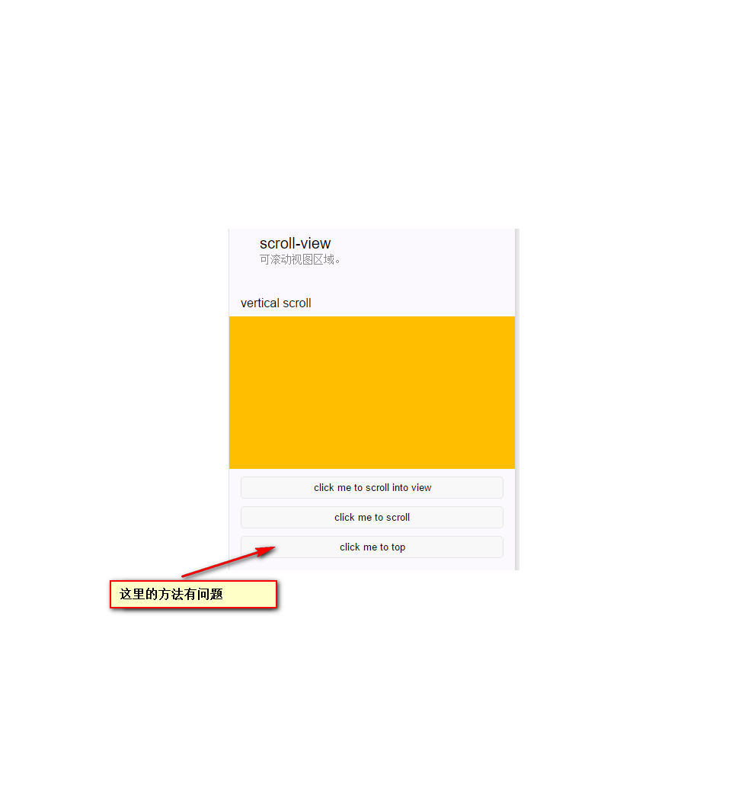
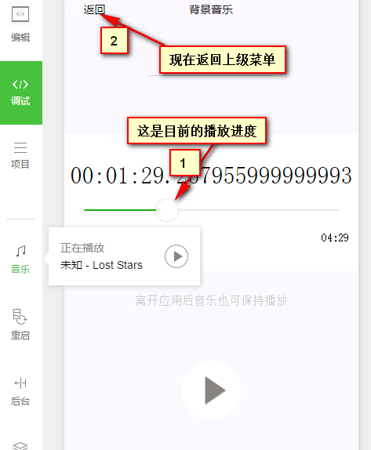
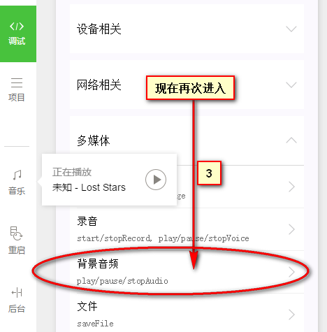
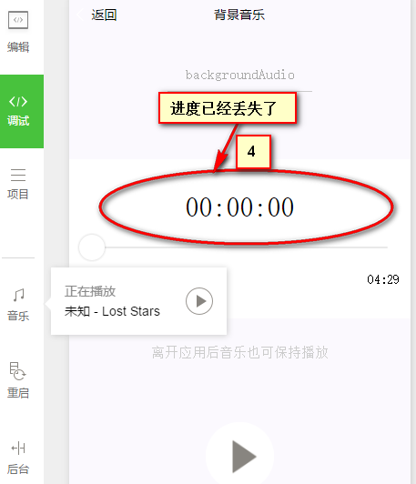
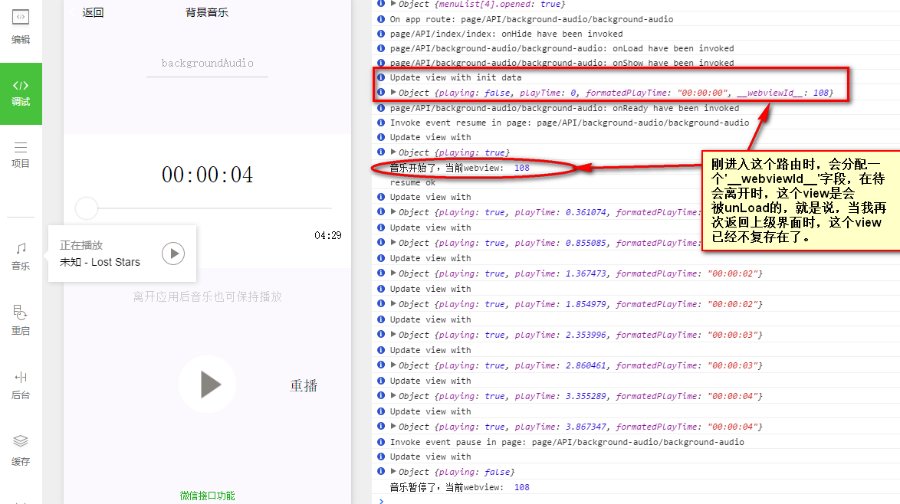
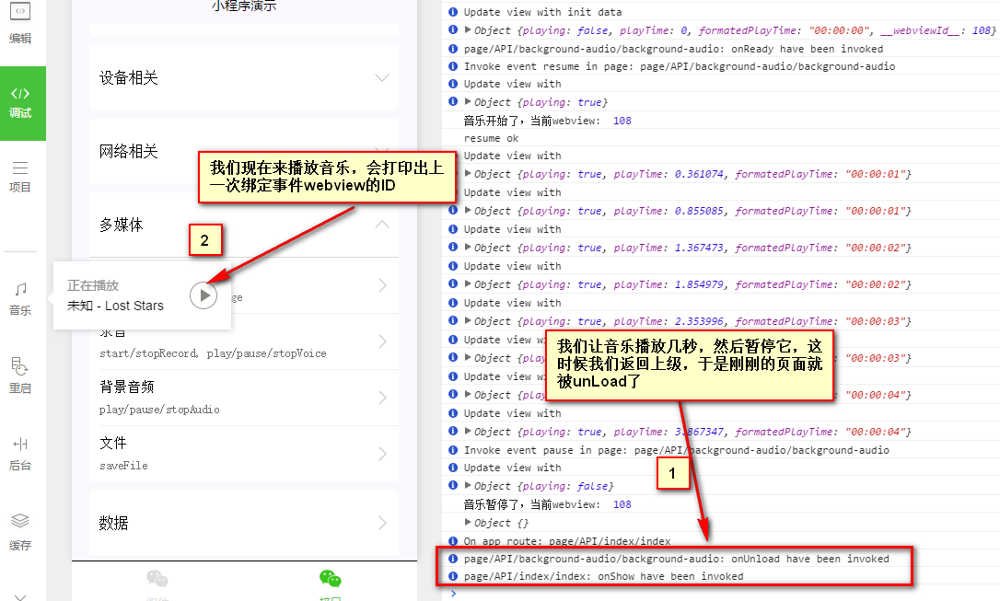
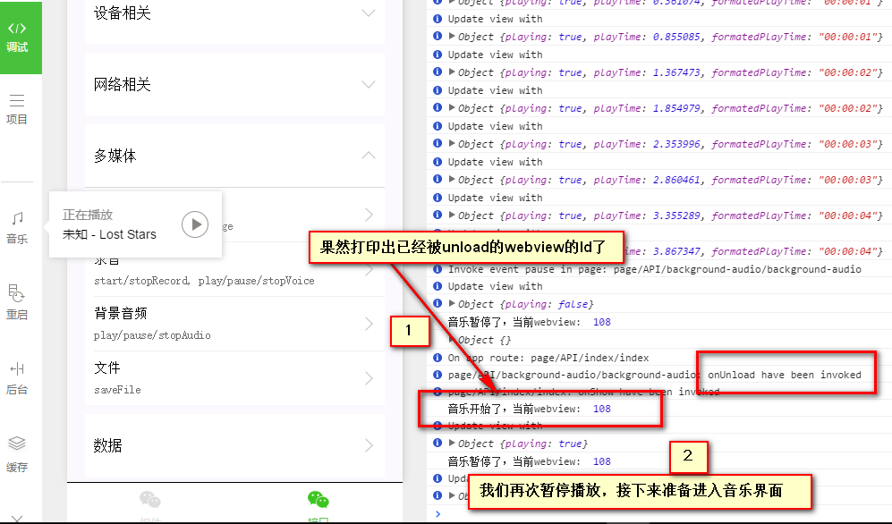
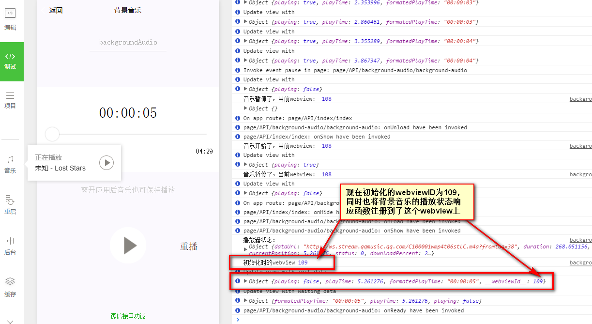
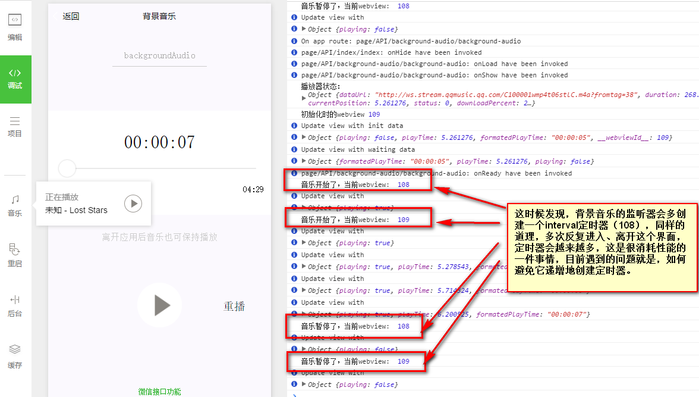

### updated 2016-09-24 20:51
#### bug：
组件中：
- 内容分区/scroll-view中，click me to top按钮无效（done）

接口中：
- 录音功能展示中，无法停止录音。（可能问题只存在电脑调试器中）（done）
- 录音功能展示中，若直接返回上一级页面，原页面的定时器未被回收（done）
- 背景音乐功能展示中，首先播放音乐并返回上级，然后再进入播放音乐页面，音乐播放进度会丢失

#### 不算bug但是美中不足的地方
组件中：
- 内容分区/swipe 中，swipe最后一张图片后会反方向到第一张图片（to be improved）
- 内容/Text 中，text默认的line删不掉，一开始体验‘remove’方法的话会产生“程序是不是有问题的错觉”
- 内容/picker 中，时间和日期选择器无效（开始以为是bug，后来发现是demo源码中没有实现这里的选择器）(to be improved)

接口中：

注:这些在接口栏目中，能在PC上测试的所有的接口都是在PC上测试的，所以可能参考意义并不是那么大

#### 修复：
1. 内容分区/scroll-view

方法：
/page/component/component-pages/wx-scroll-view/wx-scroll-view.js 16L 将setAction 改为 setData
```javascript
    scrollToTop: function(e) {
        this.setData({
          scrollTop: 0
        })
      }
```
2. 录音功能
方法：
/page/API/voice/voice.js  
	1) 将录音定时器放在全局。
    2) 在stop record中清除定时器 
    3) onUnload触发时也要清除定时器并还原初始数据
```javascript
    var util = require('../../../util/util.js')
    var playTimeInterval,interval

    Page({
      data: {
        ...
      },
      startRecord: function () {
       ...
      },
      stopRecord: function () {
        wx.stopRecord()
        this.setData({recording:false,recordTime:0,formatedRecordTime: '00:00:00'})
        clearInterval(interval)
      },
     ...
      onUnload:function(){
        this.stopRecord()
        console.log("voice page has been unloaded!")
      }
    })
```

3. 播放背景音乐进度丢失问题

方法：
/page/API/background-audio/background-audio.js 重写了一些方法
    1) 该page生命周期中的onLoad过程中，先通过api获取是否有背景音乐正在播放，获取其进度，然后将data里的数据更新,在onLoad中增加checkPlaying方法
    ```javascript
    Page({
      onLoad: function () {
        var that = this
        ...
        // 进入的时候应该检测后台是否有音乐正在播放
        checkPlaying()
        function checkPlaying() {
          wx.getBackgroundAudioPlayerState({
            success: function (res) {
              console.log("播放器状态：",res)
              console.log("初始化时的webview",that.data.__webviewId__)
              var _isPlaying,_playTime
              res.status === 1?
                _isPlaying = true:_isPlaying = false
              res.currentPosition/res.duration > 0.95?
                _playTime = 0:_playTime = res.currentPosition
              that.setData({
                playing:_isPlaying,
                playTime: _playTime,
                formatedPlayTime: util.formatTime(_playTime)
              })
              if(_isPlaying) 
                that._enableInterval()
            }
          })
        }
      },
      ...
    })
    ```
    2) 增加了resume方法，用于继续播放（play方法是从头开始播放）
    ```javascript
    Pager({
    ...
      resume:function(){
        var that = this
        if(this.updateInterval != '')
          clearInterval(this.updateInterval)
        wx.playBackgroundAudio({
          dataUrl: dataUrl,
          title: 'Lost Stars',
          coverImgUrl: 'http://y.gtimg.cn/music/photo_new/T002R150x150M000000Jhxf24CFL06.jpg?max_age=2592000',
          complete: function () {
            that.setData({
              playing:true
            })
            wx.seekBackgroundAudio({
              position: that.data.playTime,
              complete:function(){
                console.log("resume ok")
              }
            })
          }
        })
      },
    ...
    })
    ```
    3) 在onLoad中增加了背景音乐的两个状态的监听器，用于同步背景音乐状态的变化和UI的变化
    ```javascript
    Page({
      onLoad: function () {
        ...

        // 设置播放停止监听事件
        wx.onBackgroundAudioStop(function () {
          console.log("音乐停止了，当前webview: ",that.data.__webviewId__)
          that.setData({
            playing: false,
            playTime: 0,
            formatedPlayTime: '00:00:00'
          })
        })
        // 设置播放开始监听事件
        wx.onBackgroundAudioPlay(function(){
          console.log("音乐开始了，当前webview: ",that.data.__webviewId__)
          // 开始后需要更新当前歌曲的秒数
          if(that.data.playing === false)
            that.setData({
              playing:true
            })
          if(that.updateInterval >= 0)
            return
          that._enableInterval()
        })
        // 设置播放暂停监听事件
        wx.onBackgroundAudioPause(function(){
          console.log("音乐暂停了，当前webview: ",that.data.__webviewId__)
          // 暂停后，不需要继续更新歌曲秒数
          if(that.data.playing === true)
            that.setData({
              playing:false
            })
          if(that.updateInterval >= 0)
            clearInterval(that.updateInterval)
        })
      ...
      },
    ```
	4） 同时在wxml中增加了重播的按键（文字的形式），简单的在两个block中加入
    ```xml
    <block wx:if="{{playing === true}}">
        <view class="page-body-button" bindtap="stop">
          <image src="/image/stop.png"></image>
        </view>
        <view class="page-body-button" bindtap="pause">
          <image src="/image/pause.png"></image>
        </view>
        <view class="page-body-button" bindtap="play">
          <text class="restart">重播</text>
        </view>
      </block>
      <block wx:if="{{playing === false}}">
        <view class="page-body-button"></view>
        <view class="page-body-button" bindtap="resume">
          <image src="/image/play.png"></image>
        </view>
        <view class="page-body-button" bindtap="play">
          <text class="restart">重播</text>
        </view>
      </block>
    ```
    5) 再加一个样式在wxss
    ```css
    .page-body-button .restart{
      line-height: 80px;
    }
    ```
#### 仍然存在的问题
在修复背景音乐一些小bug的过程中，我发现，首先进入播放音乐界面播放歌曲，再返回上一个界面，这时候如果再进入播放音乐界面，那么播放器的功能没有问题，但是在该页面中用于更新UI的定时器会按进出次数递增。


####一些想法：
为了解决上面的问题，我有下面几个想法：
- 在这个pager的onUnload阶段，对背景音乐的监听器进行手动的清除（问题是目前的文档中并没有合适的api）
- 不使用背景音乐变化的监听器（包括"wx.onBackgroundAudioPause|wx.onBackgroundAudioStop|wx.onBackgroundAudioPlay"）,直接手动管理定时器。（我尝试过这样做，但是没有效果，定时器个数还是会随着进出次数的增加而增加，希望是我的实现错了）